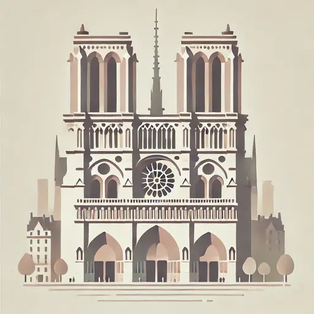
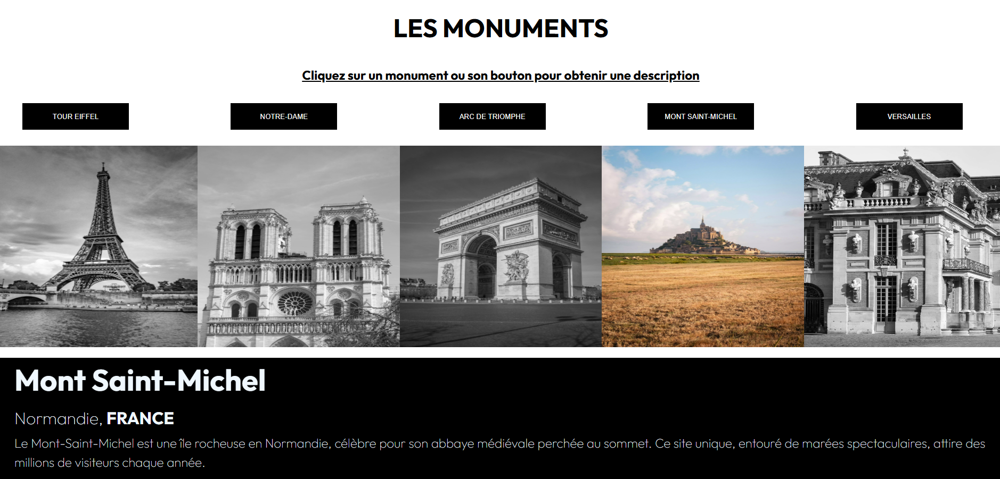

# 🏛️ Monuments de France

Un site interactif permettant de découvrir plusieurs monuments emblématiques de France 🇫🇷  
L’utilisateur peut visualiser les monuments sur une carte et obtenir des informations détaillées sur chacun d’eux.

---

## 🌟 Présentation du projet

Ce projet met en avant **les monuments français** à travers une interface claire et interactive.  
L’objectif était d’apprendre à manipuler le **DOM en JavaScript**, à structurer une page en **HTML/CSS**, et à intégrer une **carte dynamique**.

L’utilisateur peut :
- Sélectionner un monument via un bouton ou une image.
- Afficher sa description et sa localisation.
- Visualiser sa position sur une carte de France à l’aide d’un marqueur.

---

## 🎯 Objectifs et apprentissages

- Créer une **interface utilisateur** en suivant une maquette donnée.  
- Gérer les interactions grâce au **JavaScript** (clics, transitions, affichage dynamique).  
- Utiliser **Leaflet.js** pour afficher une **carte interactive** avec des marqueurs.  
- Mettre en pratique les **bonnes pratiques de développement front-end**.  
- Déployer un site statique avec **GitHub Pages**.

---

## 🛠️ Technologies utilisées

| Outil / Langage | Rôle |
|------------------|------|
| **HTML5** | Structure du contenu |
| **CSS3** | Mise en page et design |
| **JavaScript** | Interactivité et logique du site |
| **Leaflet.js** | Carte interactive et marqueurs |
| **GitHub Pages** | Hébergement du site en ligne |

---

## 💻 Fonctionnalités principales

✅ Affichage des monuments sous forme d’images et de boutons  
✅ Affichage dynamique des informations correspondantes  
✅ Transitions visuelles pour une expérience fluide  
✅ Carte interactive avec marqueurs personnalisés  

---

## 🚀 Démo en ligne
🔗 [Accéder au site](https://2024-dwwm-bsm-p4.github.io/monuments-jch/)

---

## 🧭 Améliorations envisagées

- Ajouter un système de **filtrage** par région ou type de monument  
- Connecter une **API publique** pour enrichir les données  
- Créer un mode **nuit / jour** pour le confort visuel  
- Améliorer l’accessibilité et les animations  
- Design responsive pour s’adapter à tous les écrans  

---

## 👩‍💻 À propos

Ce projet a été réalisé dans le cadre de ma formation **Développeuse Web et Web Mobile** chez **Simplon Hauts-de-France**.  
J’ai particulièrement apprécié la partie **carte interactive**, qui m’a permis de comprendre la logique de manipulation d’éléments via JavaScript et d’intégrer des données dynamiques.

📍 **Autrice du projet final et du README :** [Julie Charles](https://github.com/Julie-Charles16)  
💬 “Un projet simple, mais formateur, qui m’a permis de consolider mes bases en front-end.”

---

## 📸 Aperçu du projet

---

## 🧑‍🏫 Projet original fourni par

* [Rémy Cottrez](https://github.com/RemyCTRZ) — projet pédagogique de départ et README initial.

